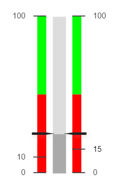

# HTML Canvas Gauges + mods

This is a fork of [HTML Canvas Gauges](https://github.com/Mikhus/canvas-gauges) with some additional functionalities

Original readme available [here](./README_ORIGINAL.md)

All credits for the HTML Canvas Gauge library go to the respective authors.

## Changelog

### v 1.1.0
- Added option to override single major tick text

### v 1.0.0
- Initial release of modded version

## Features

This fork includes the following additional features

### Value box and Units label offset

The following new settings allow you to apply an offset to the position of the Value Box and Units label:

|Option|Description|Type|Default
|-|-|-|-|
|`valueBoxVerticalOffset`|Shifts the Value Box vertically|`Number`|`0`|
|`valueBoxHorizontalOffset`|Shifts the Value Box horizontally|`Number`|`0`|
|`unitsVerticalOffset`|Shifts the units label vertically|`Number`|`0`|
|`unitsHorizontalOffset`|Shifts the units label horizontally|`Number`|`0`|


### Individual ticks options

You can set some additional options for single ticks when defining ticks directly (i.e: `exactTicks` option set to `true`) by passing a value to the gauge options' properties named `majorTicksOptions`. This property must be an array of objects, with the same length as the `majorTicks` array. Each object contains a series of settings for the corresponding tick. The available settings are as follows.

#### Show tick on a specific side (linear gauge only)
By setting the `side` property, you can control on which side (left/top, right/bottom or both) each individual tick and tick label in a linear gauge are drawn. This allows you to have some ticks on one side and some on the other, instead of having to chose the side for the entire tickbar.

The supported values for the `side` property are:
- `left` - only show the tick on the left side (or top side for horizontal gauges)
- `right` - only show the tick on the right side (or bottom side for horizontal gauges)
- `both` - show on both sides

NOTE: this option does not override the global `tickSide` option, which will still limit drawing on a single side if set to a value different from `both`.

Here is an example of use:
```JavaScript
{
    "exactTicks": true,
    "tickSide": "both",
    "majorTicks": [0, 10, 15, 100],
    "majorTicksOptions": [
        {side: "both"},
        {side: "left"},
        {side: "right"},
        {side: "both"}
        ]
    //...
}
```
the resoult would be something like this:




#### Override tick text

By setting the `text` property in any of the objects in the `majorTicksOptions` array, the corresponding tick's label will show this text, instead of the numeric value of the tick.

Here is an example of use:
```JavaScript
{
    "exactTicks": true,
    "tickSide": "both",
    "majorTicks": [0, 10, 15],
    "majorTicksOptions": [
        {text: "zero"},
        {text: "ten"},
        {text: "fifteen"}
        ]
    //...
}
```